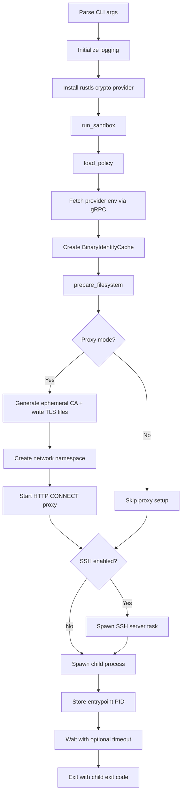
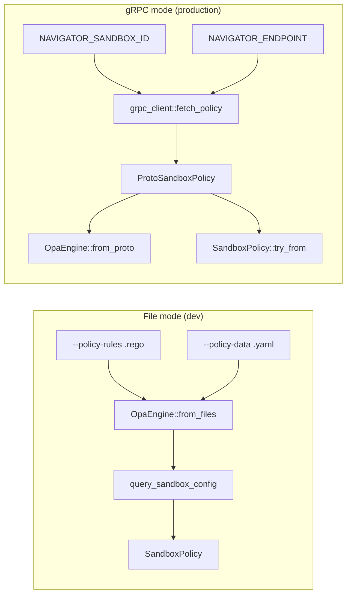
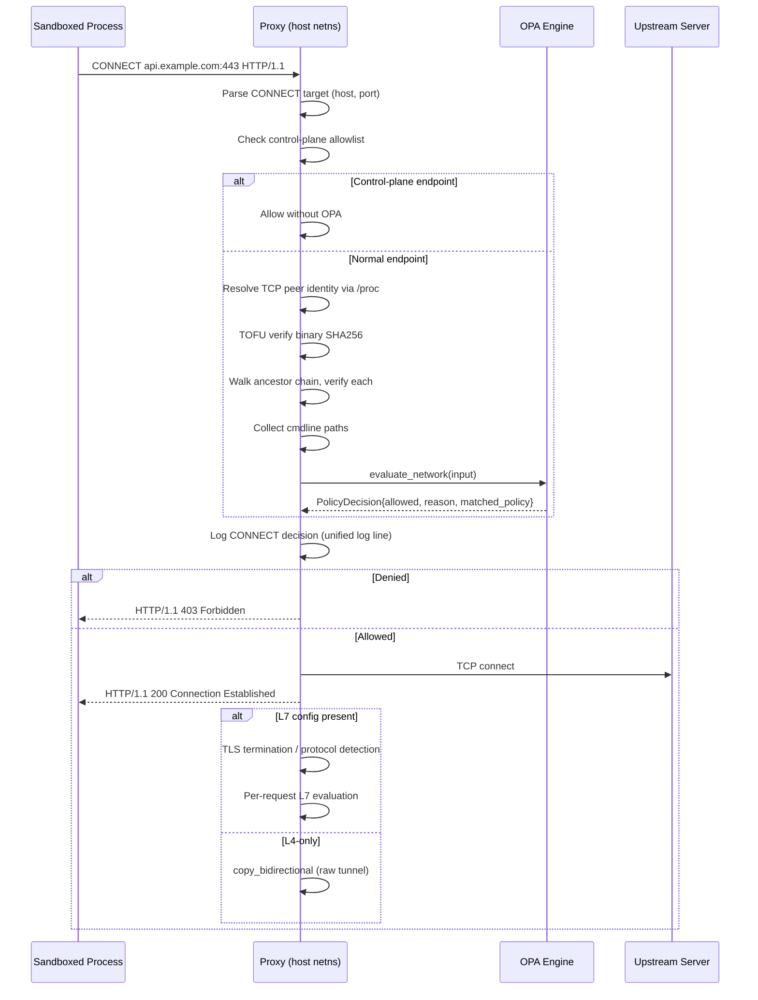
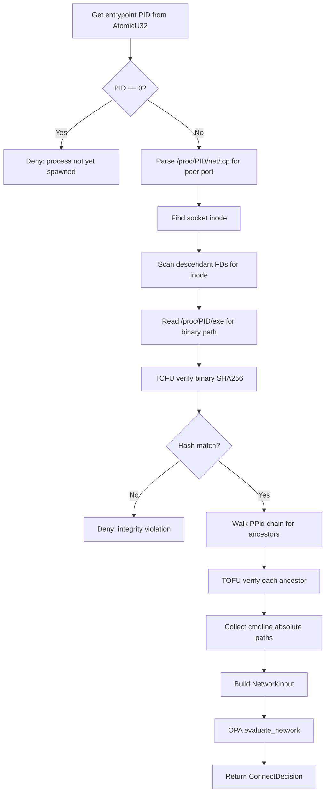
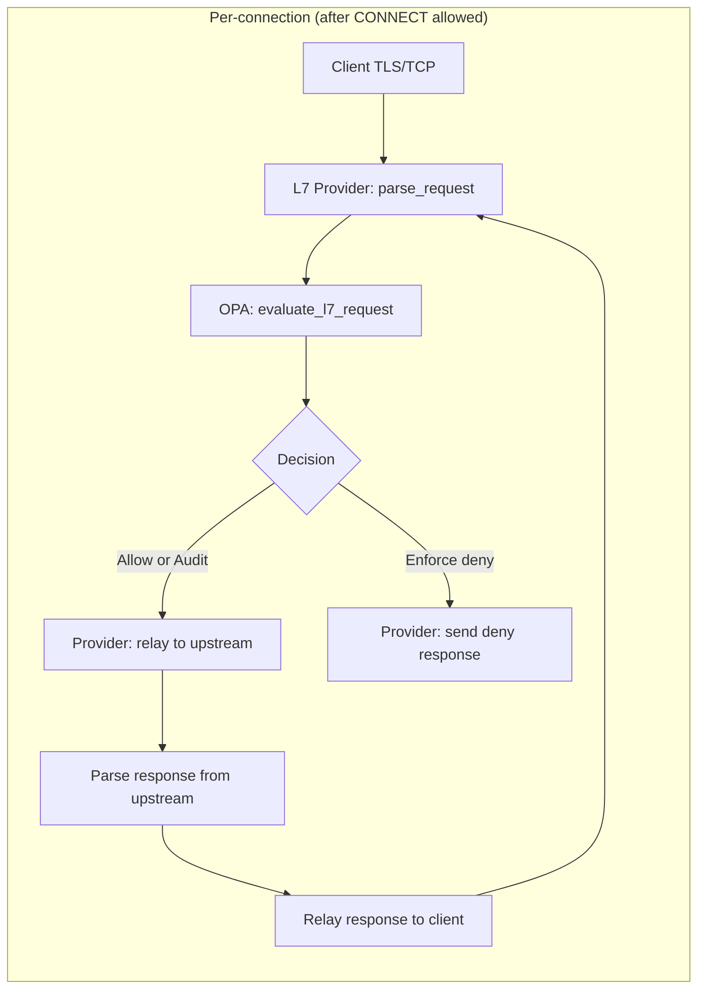
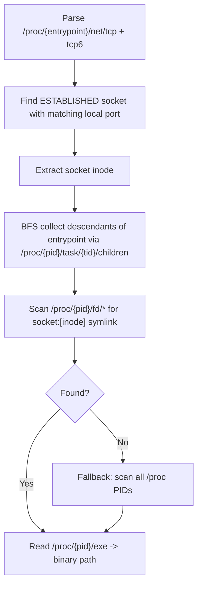

# Sandbox Architecture

The sandbox binary isolates a user-specified command inside a child process with policy-driven enforcement. It combines Linux kernel mechanisms (Landlock, seccomp, network namespaces) with an application-layer HTTP CONNECT proxy to provide filesystem, syscall, and network isolation. An embedded OPA/Rego policy engine evaluates every outbound network connection against per-binary rules, and an optional L7 inspection layer examines individual HTTP requests within allowed tunnels.

## Source File Index

All paths are relative to `crates/navigator-sandbox/src/`.

| File | Purpose |
|------|---------|
| `main.rs` | CLI entry point, argument parsing via `clap`, dual-output logging setup |
| `lib.rs` | `run_sandbox()` orchestration -- the main startup sequence |
| `policy.rs` | `SandboxPolicy`, `NetworkPolicy`, `ProxyPolicy`, `LandlockPolicy`, `ProcessPolicy` structs and proto conversions |
| `opa.rs` | OPA/Rego policy engine using `regorus` crate -- network evaluation, sandbox config queries, L7 endpoint queries |
| `process.rs` | `ProcessHandle` for spawning child processes, privilege dropping, signal handling |
| `proxy.rs` | HTTP CONNECT proxy with OPA evaluation, process-identity binding, and L7 dispatch |
| `ssh.rs` | Embedded SSH server (`russh` crate) with PTY support and handshake verification |
| `identity.rs` | `BinaryIdentityCache` -- SHA256 trust-on-first-use binary integrity |
| `procfs.rs` | `/proc` filesystem reading for TCP peer identity resolution and ancestor chain walking |
| `grpc_client.rs` | gRPC client for fetching policy and provider environment from the gateway |
| `sandbox/mod.rs` | Platform abstraction -- dispatches to Linux or no-op |
| `sandbox/linux/mod.rs` | Linux composition: Landlock then seccomp |
| `sandbox/linux/landlock.rs` | Filesystem isolation via Landlock LSM (ABI V1) |
| `sandbox/linux/seccomp.rs` | Syscall filtering via BPF on `SYS_socket` |
| `sandbox/linux/netns.rs` | Network namespace creation, veth pair setup, cleanup on drop |
| `l7/mod.rs` | L7 types (`L7Protocol`, `TlsMode`, `EnforcementMode`, `L7EndpointConfig`), config parsing, validation, access preset expansion |
| `l7/tls.rs` | Ephemeral CA generation (`SandboxCa`), per-hostname leaf cert cache (`CertCache`), TLS termination/connection helpers |
| `l7/relay.rs` | Protocol-aware bidirectional relay with per-request OPA evaluation |
| `l7/rest.rs` | HTTP/1.1 request/response parsing, body framing (Content-Length, chunked), deny response generation |
| `l7/provider.rs` | `L7Provider` trait and `L7Request`/`BodyLength` types |

## Startup and Orchestration

The `run_sandbox()` function in `crates/navigator-sandbox/src/lib.rs` is the main orchestration entry point. It executes the following steps in order.

### Orchestration flow



### Step-by-step detail

1. **Policy loading** (`load_policy()`):
   - Priority 1: `--policy-rules` + `--policy-data` provided -- load OPA engine from local Rego file and YAML data file via `OpaEngine::from_files()`. Query `query_sandbox_config()` for filesystem/landlock/process settings. Network mode forced to `Proxy`.
   - Priority 2: `--sandbox-id` + `--navigator-endpoint` provided -- fetch typed proto policy via `grpc_client::fetch_policy()`. If the proto contains `network_policies`, create OPA engine via `OpaEngine::from_proto()` using baked-in Rego rules. Convert proto to `SandboxPolicy` via `TryFrom`.
   - Neither present: return fatal error.
   - Output: `(SandboxPolicy, Option<Arc<OpaEngine>>)`

2. **Provider environment fetching**: If sandbox ID and endpoint are available, call `grpc_client::fetch_provider_environment()` to get a `HashMap<String, String>` of credential environment variables. On failure, log a warning and continue with an empty map.

3. **Binary identity cache**: If OPA engine is active, create `Arc<BinaryIdentityCache::new()>` for SHA256 TOFU enforcement.

4. **Filesystem preparation** (`prepare_filesystem()`): For each path in `filesystem.read_write`, create the directory if it does not exist and `chown` to the configured `run_as_user`/`run_as_group`. Runs as the supervisor (root) before forking.

5. **TLS state for L7 inspection** (proxy mode only):
   - Generate ephemeral CA via `SandboxCa::generate()` using `rcgen`
   - Write CA cert PEM and combined bundle (system CAs + sandbox CA) to `/etc/navigator-tls/`
   - Add the TLS directory to `policy.filesystem.read_only` so Landlock allows the child to read it
   - Build upstream `ClientConfig` with Mozilla root CAs via `webpki_roots`
   - Create `Arc<ProxyTlsState>` wrapping a `CertCache` and the upstream config

6. **Network namespace** (Linux, proxy mode only):
   - `NetworkNamespace::create()` builds the veth pair and namespace
   - Opens `/var/run/netns/sandbox-{uuid}` as an FD for later `setns()`
   - On failure: warn and continue without network isolation

7. **Proxy startup** (proxy mode only):
   - Validate that OPA engine and identity cache are present
   - Determine bind address: veth host IP if netns exists, else `policy.network.proxy.http_addr`
   - Parse the gateway endpoint URL into the control-plane allowlist
   - `ProxyHandle::start_with_bind_addr()` binds a `TcpListener` and spawns an accept loop

8. **SSH server** (optional): If `--ssh-listen-addr` is provided, spawn an async task running `ssh::run_ssh_server()` with the policy, workdir, netns FD, proxy URL, CA paths, and provider env.

9. **Child process spawning** (`ProcessHandle::spawn()`):
   - Build `tokio::process::Command` with inherited stdio and `kill_on_drop(true)`
   - Set environment variables: `NAVIGATOR_SANDBOX=1`, provider credentials, proxy URLs, TLS trust store paths
   - Pre-exec closure (async-signal-safe): `setpgid` (if non-interactive) -> `setns` (enter netns) -> `drop_privileges` -> `sandbox::apply` (Landlock + seccomp)

10. **Store entrypoint PID**: `entrypoint_pid.store(pid, Ordering::Release)` so the proxy can resolve TCP peer identity via `/proc`.

11. **Wait with timeout**: If `--timeout > 0`, wrap `handle.wait()` in `tokio::time::timeout()`. On timeout, kill the process and return exit code 124.

## Policy Model

Policy data structures live in `crates/navigator-sandbox/src/policy.rs`.

```rust
pub struct SandboxPolicy {
    pub version: u32,
    pub filesystem: FilesystemPolicy,
    pub network: NetworkPolicy,
    pub landlock: LandlockPolicy,
    pub process: ProcessPolicy,
}

pub struct FilesystemPolicy {
    pub read_only: Vec<PathBuf>,     // Landlock read-only allowlist
    pub read_write: Vec<PathBuf>,    // Landlock read-write allowlist (auto-created, chowned)
    pub include_workdir: bool,       // Add --workdir to read_write (default: true)
}

pub struct NetworkPolicy {
    pub mode: NetworkMode,           // Block | Proxy | Allow
    pub proxy: Option<ProxyPolicy>,
}

pub struct ProxyPolicy {
    pub http_addr: Option<SocketAddr>, // Loopback bind address when not using netns
}

pub struct LandlockPolicy {
    pub compatibility: LandlockCompatibility, // BestEffort | HardRequirement
}

pub struct ProcessPolicy {
    pub run_as_user: Option<String>,
    pub run_as_group: Option<String>,
}
```

### Network mode derivation

The network mode determines which enforcement mechanisms activate:

| Mode | Seccomp | Network namespace | Proxy | Use case |
|------|---------|-------------------|-------|----------|
| `Block` | Blocks `AF_INET`, `AF_INET6` + others | No | No | No network access at all |
| `Proxy` | Blocks `AF_NETLINK`, `AF_PACKET`, `AF_BLUETOOTH`, `AF_VSOCK` (allows `AF_INET`/`AF_INET6`) | Yes (Linux) | Yes | Controlled network via proxy + OPA |
| `Allow` | No seccomp filter | No | No | Unrestricted network (seccomp skipped entirely) |

In gRPC mode, the mode is derived from the proto: if `network_policies` is non-empty, mode is `Proxy`; otherwise `Block`. In file mode, the mode is always `Proxy` (the presence of `--policy-rules` implies network policy evaluation).

### Policy loading modes



## OPA Policy Engine

The OPA engine lives in `crates/navigator-sandbox/src/opa.rs` and uses the `regorus` crate -- a pure-Rust Rego evaluator with no external OPA daemon dependency.

### Baked-in rules

The Rego rules are compiled into the binary via `include_str!("../../../dev-sandbox-policy.rego")`. The package is `navigator.sandbox`. Key rules:

| Rule | Type | Purpose |
|------|------|---------|
| `allow_network` | bool | L4 allow/deny decision for a CONNECT request |
| `deny_reason` | string | Human-readable deny reason |
| `matched_network_policy` | string | Name of the matched policy rule |
| `matched_endpoint_config` | object | Full endpoint config for L7 inspection lookup |
| `allow_request` | bool | L7 per-request allow/deny decision |
| `request_deny_reason` | string | L7 deny reason |
| `filesystem_policy` | object | Static filesystem config passthrough |
| `landlock_policy` | object | Static Landlock config passthrough |
| `process_policy` | object | Static process config passthrough |

### `OpaEngine` struct

```rust
pub struct OpaEngine {
    engine: Mutex<regorus::Engine>,
}
```

The inner `regorus::Engine` requires `&mut self` for evaluation, so access is serialized via `Mutex`. This is acceptable because policy evaluation completes in microseconds and contention is low (one evaluation per CONNECT request at the L4 layer).

### Loading methods

- **`from_files(policy_path, data_path)`**: Load a user-supplied `.rego` file and YAML data file. Preprocesses data to expand access presets and validate L7 config.
- **`from_strings(policy, data_yaml)`**: Load from string content (used in tests).
- **`from_proto(proto_policy)`**: Uses the baked-in Rego rules. Converts the proto's typed fields to JSON under the `sandbox` key (matching `data.sandbox.*` references). Validates L7 config, then expands access presets.

All loading methods run the same preprocessing pipeline: L7 validation (errors block startup, warnings are logged), then access preset expansion (e.g., `access: "read-only"` becomes explicit `rules` with GET/HEAD/OPTIONS).

### Network evaluation

`evaluate_network(input: &NetworkInput) -> Result<PolicyDecision>`

Input JSON shape:
```json
{
  "exec": {
    "path": "/usr/bin/curl",
    "ancestors": ["/usr/bin/bash", "/usr/bin/node"],
    "cmdline_paths": ["/usr/local/bin/claude"]
  },
  "network": {
    "host": "api.example.com",
    "port": 443
  }
}
```

Evaluates three Rego rules:
1. `data.navigator.sandbox.allow_network` -> bool
2. `data.navigator.sandbox.deny_reason` -> string
3. `data.navigator.sandbox.matched_network_policy` -> string (or `Undefined`)

Returns `PolicyDecision { allowed, reason, matched_policy }`.

### L7 endpoint config query

After L4 allows a connection, `query_endpoint_config(input)` evaluates `data.navigator.sandbox.matched_endpoint_config` to get the full endpoint object. If the endpoint has a `protocol` field, `l7::parse_l7_config()` extracts the L7 config for protocol-aware inspection.

### Engine cloning for L7

`clone_engine_for_tunnel()` clones the inner `regorus::Engine`. With the `arc` feature, this shares compiled policy via `Arc` and only duplicates interpreter state (microseconds). The cloned engine is wrapped in its own `std::sync::Mutex` and used by the L7 relay without contention on the main engine.

### Hot reload

`reload(policy, data_yaml)` builds a new engine from strings and atomically replaces the inner engine. Designed for future gRPC-based policy updates.

## Linux Enforcement

All enforcement code runs in the child process's pre-exec closure -- after `fork()` but before `exec()`. The application order is: `setpgid` -> `setns` (netns) -> `drop_privileges` -> `sandbox::apply` (Landlock then seccomp).

### Landlock filesystem isolation

**File:** `crates/navigator-sandbox/src/sandbox/linux/landlock.rs`

Landlock restricts the child process's filesystem access to an explicit allowlist.

1. Build path lists from `filesystem.read_only` and `filesystem.read_write`
2. If `include_workdir` is true, add the working directory to `read_write`
3. If both lists are empty, skip Landlock entirely (no-op)
4. Create a Landlock ruleset targeting ABI V1:
   - Read-only paths receive `AccessFs::from_read(abi)` rights
   - Read-write paths receive `AccessFs::from_all(abi)` rights
5. Call `ruleset.restrict_self()` -- this applies to the calling process and all descendants

Error behavior depends on `LandlockCompatibility`:
- `BestEffort`: Log a warning and continue without filesystem isolation
- `HardRequirement`: Return a fatal error, aborting the sandbox

### Seccomp syscall filtering

**File:** `crates/navigator-sandbox/src/sandbox/linux/seccomp.rs`

Seccomp blocks socket creation for specific address families. The filter targets a single syscall (`SYS_socket`) and inspects argument 0 (the domain).

**Always blocked** (regardless of network mode):
- `AF_NETLINK`, `AF_PACKET`, `AF_BLUETOOTH`, `AF_VSOCK`

**Additionally blocked in `Block` mode** (no proxy):
- `AF_INET`, `AF_INET6`

**Skipped entirely** in `Allow` mode.

Setup:
1. `prctl(PR_SET_NO_NEW_PRIVS, 1)` -- required before seccomp
2. `seccompiler::apply_filter()` with default action `Allow` and per-rule action `Errno(EPERM)`

In `Proxy` mode, `AF_INET`/`AF_INET6` are allowed because the sandboxed process needs to connect to the proxy over the veth pair. The network namespace ensures it can only reach the proxy's IP (`10.200.0.1`).

### Network namespace isolation

**File:** `crates/navigator-sandbox/src/sandbox/linux/netns.rs`

The network namespace creates an isolated network stack where the sandboxed process can only communicate through the proxy.

#### Topology

```
HOST NAMESPACE                          SANDBOX NAMESPACE
-----------------                       -----------------
veth-h-{uuid}                           veth-s-{uuid}
10.200.0.1/24  <------- veth pair ----> 10.200.0.2/24
     |                                       |
     v                                       v
Proxy listener                          Sandboxed process
     |                                  (default route -> 10.200.0.1)
     v
Internet (filtered by OPA policy)
```

#### Creation sequence (`NetworkNamespace::create()`)

1. Generate UUID-based short ID (first 8 chars)
2. `ip netns add sandbox-{id}` -- create the namespace
3. `ip link add veth-h-{id} type veth peer name veth-s-{id}` -- create veth pair
4. `ip link set veth-s-{id} netns sandbox-{id}` -- move sandbox veth into namespace
5. Configure host side: assign `10.200.0.1/24`, bring up
6. Configure sandbox side (inside namespace): assign `10.200.0.2/24`, bring up loopback, add default route via `10.200.0.1`
7. Open `/var/run/netns/sandbox-{id}` FD for later `setns()` calls

Each step has rollback on failure -- if any `ip` command fails, previously created resources are cleaned up.

#### Cleanup on drop

`NetworkNamespace` implements `Drop`:
1. Close the namespace FD
2. Delete the host-side veth (`ip link delete veth-h-{id}`) -- this automatically removes the peer
3. Delete the namespace (`ip netns delete sandbox-{id}`)

#### Required capabilities

| Capability | Purpose |
|------------|---------|
| `CAP_SYS_ADMIN` | Creating network namespaces, `setns()` |
| `CAP_NET_ADMIN` | Creating veth pairs, assigning IPs, configuring routes |
| `CAP_SYS_PTRACE` | Proxy reading `/proc/<pid>/fd/` and `/proc/<pid>/exe` for processes running as a different user |

The `iproute2` package must be installed (provides the `ip` command).

If namespace creation fails (e.g., missing capabilities), the sandbox logs a warning and continues without network isolation. Seccomp still blocks raw socket domains, but without the namespace a process could bypass the proxy by connecting directly to external IPs.

## HTTP CONNECT Proxy

**File:** `crates/navigator-sandbox/src/proxy.rs`

The proxy is an async TCP listener that accepts HTTP CONNECT requests. Each connection spawns a handler task. The proxy evaluates every CONNECT request against OPA policy with full process-identity binding.

### Connection flow



### `ProxyHandle`

`ProxyHandle` wraps a `JoinHandle` and the bound address. The `Drop` implementation aborts the accept loop. `start_with_bind_addr()`:

1. Determine bind address: use the override (veth host IP) if provided, else fall back to `policy.http_addr`
2. Enforce loopback restriction when not using a network namespace override
3. Bind `TcpListener`, spawn accept loop
4. Each accepted connection spawns `handle_tcp_connection()` as a separate tokio task

### Request parsing

The proxy reads up to 8192 bytes (`MAX_HEADER_BYTES`) looking for `\r\n\r\n`. It validates the method is `CONNECT` (returning 405 for anything else) and parses the `host:port` target.

### Control-plane bypass

Connections to the gateway's own endpoint (parsed from `--navigator-endpoint`) are always allowed without OPA evaluation. This ensures the sandboxed process can reach the gateway for inference routing and other management operations. The decision engine is recorded as `"control_plane"`.

### OPA evaluation with identity binding (`evaluate_opa_tcp()`)

This is the core security evaluation path, Linux-only (requires `/proc`).



On non-Linux platforms, `evaluate_opa_tcp()` always denies with the reason "identity binding unavailable on this platform".

### `ConnectDecision` struct

```rust
struct ConnectDecision {
    allowed: bool,
    binary: Option<PathBuf>,
    binary_pid: Option<u32>,
    ancestors: Vec<PathBuf>,
    cmdline_paths: Vec<PathBuf>,
    matched_policy: Option<String>,
    engine: &'static str,       // "opa" or "control_plane"
    reason: String,
}
```

### Unified logging

Every CONNECT request produces a single `info!()` log line with all context: source/destination addresses, binary path, PID, ancestor chain, cmdline paths, action (allow/deny), engine, matched policy, and deny reason.

### Post-decision: L7 dispatch or raw tunnel

After a CONNECT is allowed and the upstream TCP connection is established:

1. **Query L7 config**: `query_l7_config()` asks the OPA engine for `matched_endpoint_config`. If the endpoint has a `protocol` field, parse it into `L7EndpointConfig`.

2. **L7 inspection** (if config present):
   - Clone the OPA engine for per-tunnel evaluation (`clone_engine_for_tunnel()`)
   - Build `L7EvalContext` with host, port, policy name, binary path, ancestors, cmdline paths
   - Branch on TLS mode:
     - `TlsMode::Terminate`: MITM via `tls_terminate_client()` + `tls_connect_upstream()`, then `relay_with_inspection()`
     - `TlsMode::Passthrough`: Peek first bytes on raw TCP; if `looks_like_http()` matches, run `relay_with_inspection()`; reject on protocol mismatch

3. **L4-only** (no L7 config): `tokio::io::copy_bidirectional()` for a raw tunnel

## L7 Protocol-Aware Inspection

**Files:** `crates/navigator-sandbox/src/l7/`

The L7 subsystem inspects application-layer traffic within CONNECT tunnels. Instead of raw `copy_bidirectional`, each request is parsed, evaluated against OPA rules, and either forwarded or blocked.

### Architecture



### Types

| Type | Definition | Purpose |
|------|-----------|---------|
| `L7Protocol` | `Rest`, `Sql` | Supported application protocols |
| `TlsMode` | `Passthrough`, `Terminate` | TLS handling strategy |
| `EnforcementMode` | `Audit`, `Enforce` | What to do on L7 deny (log-only vs block) |
| `L7EndpointConfig` | `{ protocol, tls, enforcement }` | Per-endpoint L7 configuration |
| `L7Decision` | `{ allowed, reason, matched_rule }` | Result of L7 evaluation |
| `L7RequestInfo` | `{ action, target }` | HTTP method + path for policy evaluation |

### Access presets

Policy data supports shorthand `access` presets that expand into explicit `rules` during preprocessing:

| Preset | Expands to |
|--------|-----------|
| `read-only` | `GET **`, `HEAD **`, `OPTIONS **` |
| `read-write` | `GET **`, `HEAD **`, `OPTIONS **`, `POST **`, `PUT **`, `PATCH **` |
| `full` | `* **` (all methods, all paths) |

Expansion happens in `expand_access_presets()` before the Rego engine loads the data. The `rules` and `access` fields are mutually exclusive (validated at startup).

### Policy validation

`validate_l7_policies()` runs at engine load time and returns `(errors, warnings)`:

**Errors** (block startup):
- `rules` and `access` both specified on same endpoint
- `protocol` specified without `rules` or `access`
- `tls: terminate` without a `protocol`
- `protocol: sql` with `enforcement: enforce` (SQL parsing not available in v1)
- Empty `rules` array (would deny all traffic)

**Warnings** (logged):
- `protocol: rest` on port 443 without `tls: terminate` (L7 rules ineffective on encrypted traffic)
- Unknown HTTP method in rules

### TLS termination

**File:** `crates/navigator-sandbox/src/l7/tls.rs`

TLS termination enables the proxy to inspect HTTPS traffic by performing MITM decryption.

**Ephemeral CA lifecycle:**
1. At sandbox startup, `SandboxCa::generate()` creates a self-signed CA (CN: "Navigator Sandbox CA") using `rcgen`
2. The CA cert PEM and a combined bundle (system CAs + sandbox CA) are written to `/etc/navigator-tls/`
3. The sandbox CA cert path is set as `NODE_EXTRA_CA_CERTS` (additive for Node.js)
4. The combined bundle is set as `SSL_CERT_FILE`, `REQUESTS_CA_BUNDLE`, `CURL_CA_BUNDLE` (replaces defaults for OpenSSL, Python requests, curl)

**Per-hostname leaf cert generation:**
- `CertCache` maps hostnames to `CertifiedLeaf` structs (cert chain + private key)
- First request for a hostname generates a leaf cert signed by the sandbox CA via `rcgen`
- Cache has a hard limit of 256 entries; on overflow, the entire cache is cleared (sufficient for sandbox scale)
- Each leaf cert chain contains two certs: the leaf and the CA

**Connection flow:**
1. `tls_terminate_client()`: Accept TLS from the sandboxed client using a `ServerConfig` with the hostname-specific leaf cert. ALPN: `http/1.1`.
2. `tls_connect_upstream()`: Connect TLS to the real upstream using a `ClientConfig` with Mozilla root CAs (`webpki_roots`). ALPN: `http/1.1`.
3. Proxy now holds plaintext on both sides and runs `relay_with_inspection()`.

System CA bundles are searched at well-known paths: `/etc/ssl/certs/ca-certificates.crt` (Debian/Ubuntu), `/etc/pki/tls/certs/ca-bundle.crt` (RHEL), `/etc/ssl/ca-bundle.pem` (openSUSE), `/etc/ssl/cert.pem` (Alpine/macOS).

### REST protocol provider

**File:** `crates/navigator-sandbox/src/l7/rest.rs`

Implements `L7Provider` for HTTP/1.1:

- **`parse_request()`**: Reads up to 16 KiB of headers, parses the request line (method, path), determines body framing from `Content-Length` or `Transfer-Encoding: chunked` headers. Returns `L7Request` with raw header bytes (may include overflow body bytes).

- **`relay()`**: Forwards request headers and body to upstream (handling Content-Length, chunked, and no-body cases), then reads and relays the full response back to the client.

- **`deny()`**: Sends an HTTP `403 Forbidden` JSON response with `Content-Type: application/json`, including the policy name, matched rule, and deny reason. Sets `Connection: close` and includes an `X-Navigator-Policy` header.

- **`looks_like_http()`**: Protocol detection via first-byte peek -- checks for standard HTTP method prefixes (GET, HEAD, POST, PUT, DELETE, PATCH, OPTIONS, CONNECT, TRACE).

### Per-request L7 evaluation

`relay_with_inspection()` in `crates/navigator-sandbox/src/l7/relay.rs` is the main relay loop:

1. Parse one HTTP request from client via the provider
2. Build L7 input JSON with `request.method`, `request.path`, plus the CONNECT-level context (host, port, binary, ancestors, cmdline)
3. Evaluate `data.navigator.sandbox.allow_request` and `data.navigator.sandbox.request_deny_reason`
4. Log the L7 decision (tagged `L7_REQUEST`)
5. If allowed (or audit mode): relay request to upstream and response back to client, then loop
6. If denied in enforce mode: send 403 and close the connection

## Process Identity

### SHA256 TOFU (Trust-On-First-Use)

**File:** `crates/navigator-sandbox/src/identity.rs`

`BinaryIdentityCache` wraps a `Mutex<HashMap<PathBuf, String>>` (hex-encoded SHA256 hashes).

`verify_or_cache(path)`:
- **First call for a path**: Compute SHA256 via `procfs::file_sha256()`, store as the "golden" hash, return the hash.
- **Subsequent calls**: Compute SHA256, compare with cached value. Return `Ok(hash)` on match; return `Err` on mismatch (binary tampered/replaced mid-sandbox).

The TOFU model means:
- No hashes are specified in policy data -- the first observed binary is trusted
- Once trusted, the binary cannot change for the sandbox's lifetime
- Both the immediate binary and all ancestor binaries are TOFU-verified

### /proc-based identity resolution

**File:** `crates/navigator-sandbox/src/procfs.rs`

The proxy resolves which binary is making each network request by inspecting `/proc`.

**`resolve_tcp_peer_identity(entrypoint_pid, peer_port) -> (PathBuf, u32)`**



Both IPv4 (`/proc/{pid}/net/tcp`) and IPv6 (`/proc/{pid}/net/tcp6`) tables are checked because some clients (notably gRPC C-core) use `AF_INET6` sockets with IPv4-mapped addresses.

**`collect_ancestor_binaries(pid, stop_pid) -> Vec<PathBuf>`**: Walk the PPid chain via `/proc/{pid}/status`, collecting `binary_path()` for each ancestor. Stops at PID 1, `stop_pid` (entrypoint), or after 64 levels (safety limit). Does not include `pid` itself.

**`collect_cmdline_paths(pid, stop_pid, exclude) -> Vec<PathBuf>`**: Extract absolute paths from `/proc/{pid}/cmdline` for the process and its ancestor chain. Captures script paths that don't appear in `/proc/{pid}/exe` -- for example, when `#!/usr/bin/env node` runs a script at `/usr/local/bin/claude`, the exe is `/usr/bin/node` but cmdline contains the script path. Paths already in `exclude` (exe-based paths) are omitted.

**`file_sha256(path) -> String`**: Read the file and compute `SHA256` via the `sha2` crate, returned as hex.

## Process Management

**File:** `crates/navigator-sandbox/src/process.rs`

### `ProcessHandle`

Wraps `tokio::process::Child` + PID. Platform-specific `spawn()` methods delegate to `spawn_impl()`.

**Environment setup** (both Linux and non-Linux):
- `NAVIGATOR_SANDBOX=1` (always set)
- Provider credentials (from `GetSandboxProviderEnvironment` RPC)
- Proxy URLs: `HTTP_PROXY`, `HTTPS_PROXY`, `ALL_PROXY` (uppercase for curl/wget), `http_proxy`, `https_proxy`, `grpc_proxy` (lowercase for gRPC C-core)
- TLS trust store: `NODE_EXTRA_CA_CERTS` (standalone CA cert), `SSL_CERT_FILE`, `REQUESTS_CA_BUNDLE`, `CURL_CA_BUNDLE` (combined bundle)

**Pre-exec closure** (runs in child after fork, before exec -- async-signal-safe):
1. `setpgid(0, 0)` if non-interactive (create new process group)
2. `setns(fd, CLONE_NEWNET)` to enter network namespace (Linux only)
3. `drop_privileges(policy)`: `initgroups()` -> `setgid()` -> `setuid()`
4. `sandbox::apply(policy, workdir)`: Landlock then seccomp

### `drop_privileges()`

Resolves user/group names from policy, then:
1. `initgroups()` to set supplementary groups (Linux only, not macOS)
2. `setgid()` to target group
3. `setuid()` to target user

The ordering is significant: `initgroups`/`setgid` must happen before `setuid` because switching user may drop the privileges needed for group manipulation. Similarly, privilege dropping must happen before Landlock because Landlock may block access to `/etc/passwd` and `/etc/group`.

### `ProcessStatus`

Exit code is `code` if the process exited normally, or `128 + signal` if killed by a signal (standard Unix convention). Returns `-1` if neither is available.

### Signal handling

`kill()` sends SIGTERM, waits 100ms, then sends SIGKILL if the process is still running.

## SSH Server

**File:** `crates/navigator-sandbox/src/ssh.rs`

The embedded SSH server provides remote shell access to the sandbox. It uses the `russh` crate and allocates PTYs for interactive sessions.

### Startup

`run_ssh_server()`:
1. Generate an ephemeral Ed25519 host key via `russh::keys::PrivateKey::random()`
2. Bind a `TcpListener` to the configured address
3. Accept connections in a loop, spawning per-connection handlers

### Handshake verification

Before the SSH protocol begins, the server reads a preface line:

```
NSSH1 {token} {timestamp} {nonce} {hmac_hex}\n
```

`verify_preface()`:
1. Verify magic is `NSSH1` and exactly 5 fields
2. Verify `|now - timestamp|` is within `--ssh-handshake-skew-secs` (default 300s)
3. Compute `HMAC-SHA256(secret, "{token}|{timestamp}|{nonce}")` and compare with `{hmac_hex}`
4. Send `OK\n` on success, `ERR\n` on failure

This pre-SSH handshake authenticates the gateway-to-sandbox tunnel. After it succeeds, the SSH session uses permissive authentication (`auth_none` and `auth_publickey` both return `Accept`) since the transport is already verified.

### Shell/exec handling

The `SshHandler` implements `russh::server::Handler`:

- **`pty_request()`**: Store terminal dimensions for PTY allocation
- **`shell_request()`**: Start an interactive `/bin/bash -i`
- **`exec_request()`**: Start `/bin/bash -lc {command}`
- **`window_change_request()`**: Resize PTY via `TIOCSWINSZ` ioctl
- **`data()`**: Forward client input to the PTY via an `mpsc::channel`

### PTY child process

`spawn_pty_shell()`:
1. `openpty()` to create a master/slave PTY pair
2. Build `std::process::Command` (not tokio) with slave FDs for stdin/stdout/stderr
3. Set environment: `NAVIGATOR_SANDBOX=1`, `HOME=/sandbox`, `USER=sandbox`, `TERM={negotiated}`, proxy URLs, TLS trust store paths, provider credentials
4. Install pre-exec closure (via `unsafe_pty::install_pre_exec()`):
   - `setsid()` to create a new session
   - `TIOCSCTTY` ioctl to set the controlling terminal
   - `setns()` to enter the network namespace (Linux)
   - `drop_privileges()` then `sandbox::apply()` (Landlock + seccomp)
5. Spawn three threads:
   - **Writer thread**: Reads from `mpsc::Receiver`, writes to PTY master
   - **Reader thread**: Reads from PTY master, sends SSH channel data, sends EOF when done, signals the exit thread
   - **Exit thread**: Waits for child to exit, waits for reader to finish (ensures correct SSH protocol ordering: data -> EOF -> exit-status -> close), sends exit status and closes the channel

## Zombie Reaping (PID 1 Init Duties)

`navigator-sandbox` runs as PID 1 inside the container. In Linux, when a process exits, its parent must call `waitpid()` to collect the exit status; otherwise the process remains as a zombie. Orphaned processes (whose parent exits first) are reparented to PID 1, which becomes responsible for reaping them.

Coding agents running inside the sandbox (OpenClaw, Claude, Codex) frequently spawn background daemons and child processes. When these grandchildren are orphaned, they become PID 1's responsibility. Without reaping, they accumulate as zombies for the lifetime of the container.

**File:** `crates/navigator-sandbox/src/lib.rs`

The sandbox supervisor registers a `SIGCHLD` handler at startup and spawns a background reaper task. The reaper also runs on a 5-second interval timer as a fallback in case signals are coalesced or missed. On each wake, it loops calling `waitid(Id::All, WEXITED | WNOHANG | WNOWAIT)` to inspect exited children without consuming their status. For each exited child:

1. Check `MANAGED_CHILDREN` (a `Mutex<HashSet<i32>>`) to determine if the PID belongs to a managed child (entrypoint or SSH session process) that has an explicit waiter.
2. If managed, break out of the loop -- the explicit `child.wait()` call owns that status.
3. If not managed (an orphaned grandchild), call `waitpid(pid, WNOHANG)` to reap it.

This two-phase approach (peek with `WNOWAIT`, then selectively reap) avoids `ECHILD` races with explicit `child.wait()` calls on managed children while still collecting orphan zombies. The `MANAGED_CHILDREN` set is updated via `register_managed_child()` (at spawn) and `unregister_managed_child()` (after wait completes). This feature is Linux-only (`#[cfg(target_os = "linux")]`).

## Environment Variables Reference

### Configuration (CLI flags / env vars)

| Variable | CLI flag | Default | Purpose |
|----------|----------|---------|---------|
| `NAVIGATOR_SANDBOX_COMMAND` | (trailing args) | `/bin/bash` | Command to execute inside sandbox |
| `NAVIGATOR_SANDBOX_ID` | `--sandbox-id` | | Sandbox ID for gRPC policy fetch |
| `NAVIGATOR_ENDPOINT` | `--navigator-endpoint` | | Gateway gRPC endpoint |
| `NAVIGATOR_POLICY_RULES` | `--policy-rules` | | Path to Rego policy file |
| `NAVIGATOR_POLICY_DATA` | `--policy-data` | | Path to YAML data file |
| `NAVIGATOR_LOG_LEVEL` | `--log-level` | `warn` | Log level (trace/debug/info/warn/error) |
| `NAVIGATOR_SSH_LISTEN_ADDR` | `--ssh-listen-addr` | | SSH server bind address |
| `NAVIGATOR_SSH_HANDSHAKE_SECRET` | `--ssh-handshake-secret` | | HMAC secret for SSH handshake |
| `NAVIGATOR_SSH_HANDSHAKE_SKEW_SECS` | `--ssh-handshake-skew-secs` | `300` | Allowed clock skew for handshake |

### Injected into child process

| Variable | Purpose |
|----------|---------|
| `NAVIGATOR_SANDBOX` | Always `"1"` -- signals the process is sandboxed |
| `HTTP_PROXY` / `HTTPS_PROXY` / `ALL_PROXY` | Proxy URL (uppercase, for curl/wget) |
| `http_proxy` / `https_proxy` / `grpc_proxy` | Proxy URL (lowercase, for gRPC C-core) |
| `NODE_EXTRA_CA_CERTS` | Path to sandbox CA cert PEM (Node.js, additive) |
| `SSL_CERT_FILE` | Combined CA bundle path (OpenSSL/Python/Go) |
| `REQUESTS_CA_BUNDLE` | Combined CA bundle path (Python requests) |
| `CURL_CA_BUNDLE` | Combined CA bundle path (curl/libcurl) |
| Provider credentials | From `GetSandboxProviderEnvironment` RPC (e.g., `ANTHROPIC_API_KEY`) |

### Injected into SSH child process (additional)

| Variable | Purpose |
|----------|---------|
| `HOME` | `/sandbox` |
| `USER` | `sandbox` |
| `TERM` | Negotiated terminal type (default `xterm-256color`) |

## Error Handling and Graceful Degradation

The sandbox uses `miette` for error reporting and `thiserror` for typed errors. The general principle is: fail hard on security-critical errors, degrade gracefully on non-critical ones.

| Condition | Behavior |
|-----------|----------|
| Policy fetch failure (gRPC or file) | Fatal -- sandbox cannot start without policy |
| Provider env fetch failure | Warn + continue with empty map |
| Landlock failure + `BestEffort` | Warn + continue without filesystem isolation |
| Landlock failure + `HardRequirement` | Fatal |
| Seccomp failure | Fatal |
| Network namespace creation failure | Warn + continue without isolation (seccomp still blocks raw socket domains) |
| Ephemeral CA generation failure | Warn + TLS termination disabled (L7 inspection on TLS endpoints will not work) |
| CA file write failure | Warn + TLS termination disabled |
| OPA engine Mutex lock poisoned | Error on the individual evaluation |
| Binary integrity TOFU mismatch | Deny the specific CONNECT request |
| Proxy accept error | Log + break accept loop |
| Benign connection close (EOF, reset, pipe) | Debug level (not visible to user by default) |
| L7 parse error | Close the connection |
| SSH server failure | Async task error logged, main process unaffected |
| Process timeout | Kill process, return exit code 124 |

## Logging

Dual-output logging is configured in `main.rs`:
- **stdout**: Filtered by `--log-level` (default `warn`), uses ANSI colors
- **`/var/log/navigator.log`**: Fixed at `info` level, no ANSI, non-blocking writer

Key structured log events:
- `CONNECT`: One per proxy CONNECT request with full identity context
- `L7_REQUEST`: One per L7-inspected request with method, path, and decision
- Sandbox lifecycle events: process start, exit, namespace creation/cleanup

## Platform Support

Platform-specific code is abstracted through `crates/navigator-sandbox/src/sandbox/mod.rs`.

| Feature | Linux | Other platforms |
|---------|-------|-----------------|
| Landlock | Applied via `landlock` crate (ABI V1) | Warning + no-op |
| Seccomp | Applied via `seccompiler` crate | No-op |
| Network namespace | Full veth pair isolation | Not available |
| `/proc` identity binding | Full support | `evaluate_opa_tcp()` always denies |
| Proxy | Functional (binds to veth IP or loopback) | Functional (loopback only, no identity binding) |
| SSH server | Full support (with netns for shell processes) | Functional (no netns isolation for shell processes) |
| Privilege dropping | `initgroups` + `setgid` + `setuid` | `setgid` + `setuid` (no `initgroups` on macOS) |

On non-Linux platforms, the sandbox can still run commands with proxy-based network filtering, but the kernel-level isolation (filesystem, syscall, namespace) and process-identity binding are unavailable.

## Cross-References

- [Overview](README.md) -- System-wide architecture context
- [Gateway Architecture](gateway.md) -- gRPC services that serve policy to the sandbox
- [Container Management](build-containers.md) -- How sandbox containers are built and deployed
- [Sandbox Connect](sandbox-connect.md) -- SSH tunnel from gateway to sandbox
- [Providers](sandbox-providers.md) -- Provider credential injection
- [Policy Language](security-policy.md) -- Rego policy syntax and rules
