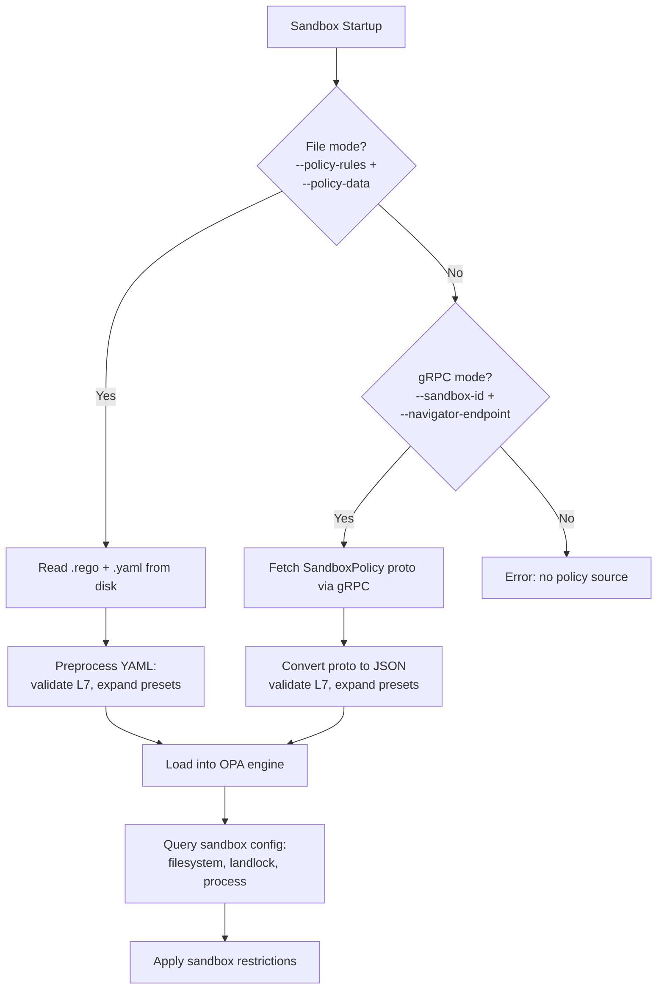
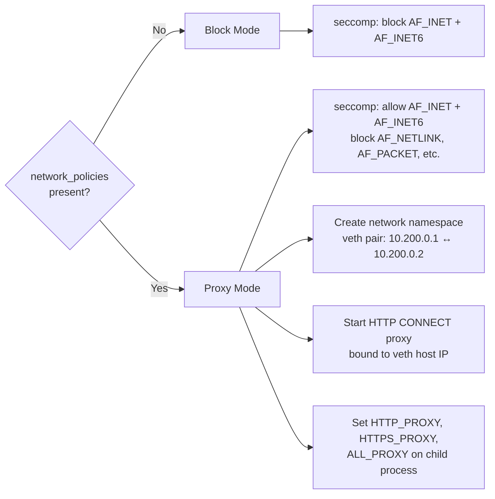
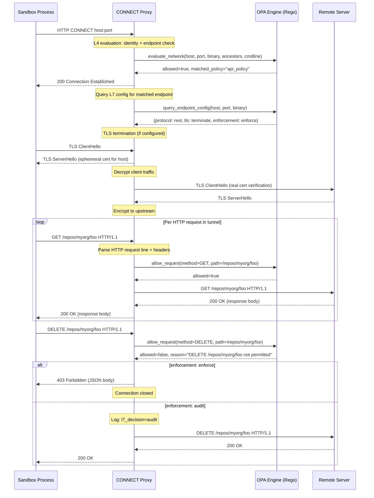

# Policy Language

The sandbox system uses a YAML-based policy language to govern sandbox behavior. This document is the definitive reference for the policy schema, how each field maps to enforcement mechanisms, and the behavioral triggers that control which enforcement layer is activated.

Policies serve two purposes:
1. **Static configuration** -- filesystem access rules, Landlock compatibility, and process privilege dropping (applied once at sandbox startup).
2. **Dynamic network decisions** -- per-connection and per-request access control evaluated at runtime by the OPA engine.

## Policy Loading

The sandbox supervisor loads policy through one of two paths, selected at startup based on available configuration.

### File Mode (Local Development)

Provide a Rego rules file and a YAML data file via CLI flags or environment variables:

```bash
navigator-sandbox \
  --policy-rules dev-sandbox-policy.rego \
  --policy-data dev-sandbox-policy.yaml \
  -- /bin/bash
```

| Flag | Environment Variable | Description |
|------|---------------------|-------------|
| `--policy-rules` | `NAVIGATOR_POLICY_RULES` | Path to `.rego` file containing evaluation rules |
| `--policy-data` | `NAVIGATOR_POLICY_DATA` | Path to YAML file containing policy data |

The YAML data file is preprocessed before loading into the OPA engine: L7 policies are validated, and `access` presets are expanded into explicit `rules` arrays. See `crates/navigator-sandbox/src/opa.rs` -- `preprocess_yaml_data()`.

### gRPC Mode (Production)

When the sandbox runs inside a managed cluster, it fetches its typed protobuf policy from the gateway:

```bash
navigator-sandbox \
  --sandbox-id abc123 \
  --navigator-endpoint http://navigator:8080 \
  -- /bin/bash
```

| Flag | Environment Variable | Description |
|------|---------------------|-------------|
| `--sandbox-id` | `NAVIGATOR_SANDBOX_ID` | Sandbox ID for policy lookup |
| `--navigator-endpoint` | `NAVIGATOR_ENDPOINT` | Gateway gRPC endpoint |

The gateway returns a `SandboxPolicy` protobuf message (defined in `proto/sandbox.proto`). The sandbox supervisor converts this proto into JSON, validates L7 config, expands presets, and loads it into the OPA engine using baked-in Rego rules (`dev-sandbox-policy.rego` compiled via `include_str!`). See `crates/navigator-sandbox/src/opa.rs` -- `OpaEngine::from_proto()`.

### Policy Loading Sequence



### Priority

File mode takes precedence. If both `--policy-rules`/`--policy-data` and `--sandbox-id`/`--navigator-endpoint` are provided, file mode is used. See `crates/navigator-sandbox/src/lib.rs` -- `load_policy()`.

## Full YAML Policy Schema

The YAML data file contains top-level keys that map directly to the OPA data namespace (`data.*`). The following sections document every field.

### Top-Level Structure

```yaml
# Optional version field (currently informational)
version: 1

# Filesystem access policy (applied at startup via Landlock)
filesystem_policy:
  include_workdir: true
  read_only: []
  read_write: []

# Landlock LSM configuration
landlock:
  compatibility: best_effort

# Process privilege configuration
process:
  run_as_user: sandbox
  run_as_group: sandbox

# Network policies (evaluated per-CONNECT request via OPA)
network_policies:
  policy_name:
    name: policy_name
    endpoints: []
    binaries: []

# Inference routing policy (gRPC mode only)
inference:
  allowed_routing_hints: []
```

---

### `filesystem_policy`

Controls which filesystem paths the sandboxed process can access. Enforced via Linux Landlock LSM at process startup.

| Field | Type | Default | Description |
|-------|------|---------|-------------|
| `include_workdir` | `bool` | `true` | Automatically add the working directory to the read-write list |
| `read_only` | `string[]` | `[]` | Paths accessible in read-only mode |
| `read_write` | `string[]` | `[]` | Paths accessible in read-write mode |

**Enforcement mapping**: Each path becomes a Landlock `PathBeneath` rule. Read-only paths receive `AccessFs::from_read(ABI::V1)` permissions. Read-write paths receive `AccessFs::from_all(ABI::V1)` permissions (read, write, execute, create, delete, rename). All other paths are denied by the Landlock ruleset.

**Filesystem preparation**: Before the child process spawns, the supervisor creates any `read_write` directories that do not exist and sets their ownership to `process.run_as_user`:`process.run_as_group` via `chown()`. See `crates/navigator-sandbox/src/lib.rs` -- `prepare_filesystem()`.

**Working directory**: When `include_workdir` is `true` and a `--workdir` is specified, the working directory path is appended to `read_write` if not already present. See `crates/navigator-sandbox/src/sandbox/linux/landlock.rs` -- `apply()`.

**TLS directory**: When network proxy mode is active with TLS termination enabled, the directory `/etc/navigator-tls` is automatically appended to `read_only` so sandbox processes can read the ephemeral CA certificate files.

```yaml
filesystem_policy:
  include_workdir: true
  read_only:
    - /usr
    - /lib
    - /proc/self
    - /dev/urandom
    - /app
    - /etc
  read_write:
    - /sandbox
    - /tmp
```

---

### `landlock`

Controls Landlock LSM compatibility behavior.

| Field | Type | Default | Description |
|-------|------|---------|-------------|
| `compatibility` | `string` | `"best_effort"` | How to handle Landlock unavailability |

**Accepted values**:

| Value | Behavior |
|-------|----------|
| `best_effort` | If Landlock is unavailable (older kernel, unprivileged container), log a warning and continue without filesystem sandboxing |
| `hard_requirement` | If Landlock is unavailable, abort sandbox startup with an error |

See `crates/navigator-sandbox/src/sandbox/linux/landlock.rs` -- `compat_level()`.

```yaml
landlock:
  compatibility: best_effort
```

---

### `process`

Controls privilege dropping for the sandboxed process.

| Field | Type | Default | Description |
|-------|------|---------|-------------|
| `run_as_user` | `string` | `""` (no drop) | Unix user name to switch to before exec |
| `run_as_group` | `string` | `""` (no drop) | Unix group name to switch to before exec |

**Enforcement sequence** (in the child process `pre_exec`, before sandbox restrictions are applied):
1. `initgroups()` -- set supplementary groups for the target user
2. `setgid()` -- switch to the target group
3. `setuid()` -- switch to the target user

This happens before Landlock and seccomp are applied because `initgroups` needs access to `/etc/group` and `/etc/passwd`, which Landlock may subsequently block. See `crates/navigator-sandbox/src/process.rs` -- `drop_privileges()`.

```yaml
process:
  run_as_user: sandbox
  run_as_group: sandbox
```

---

### `network_policies`

A map of named network policy rules. Each rule defines which binary/endpoint pairs are allowed to make outbound network connections. This is the core of the network access control system.

**Behavioral trigger**: The mere presence of any entries in `network_policies` switches the sandbox to **proxy mode**. When `network_policies` is empty or absent, the sandbox operates in **block mode** where all outbound network access is denied via seccomp.

```yaml
network_policies:
  claude_code:          # <-- map key (arbitrary identifier)
    name: claude_code   # <-- human-readable name (used in audit logs)
    endpoints:          # <-- allowed host:port pairs
      - { host: api.anthropic.com, port: 443 }
    binaries:           # <-- allowed binary identities
      - { path: /usr/local/bin/claude }
```

#### Network Policy Rule

| Field | Type | Required | Description |
|-------|------|----------|-------------|
| `name` | `string` | Yes | Human-readable policy name (appears in proxy log lines as `policy=`) |
| `endpoints` | `NetworkEndpoint[]` | Yes | List of allowed host:port pairs |
| `binaries` | `NetworkBinary[]` | Yes | List of allowed binary identities |

#### `NetworkEndpoint`

Each endpoint defines a network destination and, optionally, L7 inspection behavior.

| Field | Type | Default | Description |
|-------|------|---------|-------------|
| `host` | `string` | _(required)_ | Hostname to match (case-insensitive) |
| `port` | `integer` | _(required)_ | TCP port to match |
| `protocol` | `string` | `""` | Application protocol for L7 inspection. See [Behavioral Trigger: L7 Inspection](#behavioral-trigger-l7-inspection). |
| `tls` | `string` | `"passthrough"` | TLS handling mode. See [Behavioral Trigger: TLS Termination](#behavioral-trigger-tls-termination). |
| `enforcement` | `string` | `"audit"` | L7 enforcement mode: `"enforce"` or `"audit"` |
| `access` | `string` | `""` | Shorthand preset for common L7 rule sets. Mutually exclusive with `rules`. |
| `rules` | `L7Rule[]` | `[]` | Explicit L7 allow rules. Mutually exclusive with `access`. |

#### `NetworkBinary`

| Field | Type | Required | Description |
|-------|------|----------|-------------|
| `path` | `string` | Yes | Filesystem path of the binary. Supports glob patterns (`*`, `**`). |

**Binary identity matching** is evaluated in the Rego rules (`dev-sandbox-policy.rego`) using four strategies, tried in order:

1. **Direct path match** -- `exec.path == binary.path`
2. **Ancestor match** -- any entry in `exec.ancestors` matches `binary.path`
3. **Cmdline match** -- any entry in `exec.cmdline_paths` matches `binary.path` (for script interpreters -- e.g., `/usr/bin/node` runs `/usr/local/bin/claude`, the exe is `node` but cmdline contains `claude`)
4. **Glob match** -- if `binary.path` contains `*`, all paths (direct, ancestors, cmdline) are tested via `glob.match(pattern, ["/"], path)`. The `*` wildcard does not cross `/` boundaries. Use `**` for recursive matching.

#### `L7Rule`

Each rule contains a single `allow` block. Rules are allow-only; anything not explicitly allowed is denied.

```yaml
rules:
  - allow:
      method: GET
      path: "/repos/**"
  - allow:
      method: POST
      path: "/repos/*/issues"
```

#### `L7Allow`

| Field | Type | Description |
|-------|------|-------------|
| `method` | `string` | HTTP method: `GET`, `HEAD`, `POST`, `PUT`, `DELETE`, `PATCH`, `OPTIONS`, or `*` (any). Case-insensitive matching. |
| `path` | `string` | URL path glob pattern: `**` matches everything, otherwise `glob.match` with `/` delimiter. |
| `command` | `string` | SQL command: `SELECT`, `INSERT`, `UPDATE`, `DELETE`, or `*` (any). Case-insensitive matching. For `protocol: sql` endpoints. |

Method and command fields use `*` as wildcard for "any". Path patterns use `**` for "match everything" and standard glob patterns with `/` as a delimiter otherwise. See `dev-sandbox-policy.rego` -- `method_matches()`, `path_matches()`, `command_matches()`.

#### Access Presets

The `access` field provides shorthand for common rule sets. During preprocessing, presets are expanded into explicit `rules` arrays before Rego evaluation.

| Preset | Expands To | Description |
|--------|-----------|-------------|
| `read-only` | `GET/**`, `HEAD/**`, `OPTIONS/**` | Safe read-only HTTP methods on all paths |
| `read-write` | `GET/**`, `HEAD/**`, `OPTIONS/**`, `POST/**`, `PUT/**`, `PATCH/**` | Read and write but not delete |
| `full` | `*/**` | All methods, all paths |

See `crates/navigator-sandbox/src/l7/mod.rs` -- `expand_access_presets()`.

---

### `inference`

Controls access to the platform's inference routing system (gRPC mode only, included in the `SandboxPolicy` proto but not consumed by the sandbox supervisor directly).

| Field | Type | Default | Description |
|-------|------|---------|-------------|
| `allowed_routing_hints` | `string[]` | `[]` | Which routing hints the sandbox may request. e.g., `["local"]` for private-only, `["local", "frontier"]` for full access. Empty means no inference allowed. |

```yaml
inference:
  allowed_routing_hints:
    - local
```

---

## Behavioral Triggers

Several policy fields trigger fundamentally different enforcement behavior. Understanding these triggers is critical for writing correct policies.

### Network Mode: Block vs. Proxy

**Trigger**: The presence or absence of entries in `network_policies`.

| Condition | Network Mode | Behavior |
|-----------|-------------|----------|
| `network_policies` is empty or absent | **Block** | Seccomp blocks all `socket()` calls for `AF_INET` and `AF_INET6`. No network proxy is started. No outbound TCP connections are possible. |
| `network_policies` has any entries | **Proxy** | Seccomp allows `AF_INET` and `AF_INET6` sockets. An HTTP CONNECT proxy starts. A network namespace with veth pair isolates the sandbox. `HTTP_PROXY`/`HTTPS_PROXY`/`ALL_PROXY` environment variables are set on the child process. |

In proxy mode, the seccomp filter still blocks `AF_NETLINK`, `AF_PACKET`, `AF_BLUETOOTH`, and `AF_VSOCK` socket domains regardless. See `crates/navigator-sandbox/src/sandbox/linux/seccomp.rs` -- `build_filter()`.



### Behavioral Trigger: L7 Inspection

**Trigger**: The `protocol` field on a `NetworkEndpoint`.

| Condition | Enforcement Layer | Behavior |
|-----------|------------------|----------|
| `protocol` absent or empty | **L4 (transport)** | The proxy performs a raw `copy_bidirectional` after the CONNECT handshake. No application-layer inspection occurs. Only the host:port and binary identity are checked. |
| `protocol: rest` | **L7 (application)** | The proxy parses each HTTP/1.1 request within the tunnel, evaluates method+path against the endpoint's `rules`, and either forwards or denies each request individually. |
| `protocol: sql` | **L7 (application, audit-only)** | Reserved for SQL protocol inspection. Currently falls through to passthrough with a warning. `enforcement: enforce` is rejected at validation time for SQL endpoints. |

This is the single most important behavioral trigger in the policy language. An endpoint with no `protocol` field passes traffic opaquely after the L4 (CONNECT) check. Adding `protocol: rest` activates per-request HTTP parsing and policy evaluation inside the proxy.

**Implementation path**: After L4 CONNECT is allowed, the proxy calls `query_l7_config()` which evaluates the Rego rule `data.navigator.sandbox.matched_endpoint_config`. This rule only matches endpoints that have a `protocol` field set (see `dev-sandbox-policy.rego` line `ep.protocol`). If a config is returned, the proxy enters `relay_with_inspection()` instead of `copy_bidirectional()`. See `crates/navigator-sandbox/src/proxy.rs` -- `handle_tcp_connection()`.

**Validation requirement**: When `protocol` is set, either `rules` or `access` must also be present. An endpoint with `protocol` but no rules/access is rejected at validation time because it would deny all traffic (no allow rules means nothing matches). See `crates/navigator-sandbox/src/l7/mod.rs` -- `validate_l7_policies()`.

### Behavioral Trigger: TLS Termination

**Trigger**: The `tls` field on a `NetworkEndpoint`.

| Condition | Behavior |
|-----------|----------|
| `tls` absent or `"passthrough"` | For L7 endpoints: the proxy inspects plaintext only. For HTTPS endpoints (port 443), L7 rules will not be evaluated because the traffic is encrypted. A validation warning is emitted. |
| `tls: "terminate"` | The proxy performs MITM TLS termination: it presents a dynamically-generated certificate (signed by an ephemeral per-sandbox CA) to the client, decrypts the traffic, inspects the plaintext HTTP, then re-encrypts to upstream using real root CAs (webpki-roots). |

**Prerequisites for TLS termination**:
- The `protocol` field must also be set. `tls: terminate` without `protocol` is rejected at validation time.
- The sandbox supervisor generates an ephemeral CA at startup (`SandboxCa::generate()`) and writes it to `/etc/navigator-tls/`.
- Trust store environment variables are set on the child process: `NODE_EXTRA_CA_CERTS`, `SSL_CERT_FILE`, `REQUESTS_CA_BUNDLE`, `CURL_CA_BUNDLE`.
- A combined CA bundle (system CAs + sandbox CA) is written to `/etc/navigator-tls/ca-bundle.pem` so `SSL_CERT_FILE` replaces the default trust store while still trusting real CAs.

**Certificate caching**: Per-hostname leaf certificates are cached (up to 256 entries, then the entire cache is cleared). See `crates/navigator-sandbox/src/l7/tls.rs` -- `CertCache`.

**Validation warning**: When `protocol: rest` is set on port 443 without `tls: terminate`, the validator emits a warning: "L7 rules won't be evaluated on encrypted traffic without `tls: terminate`".

### Behavioral Trigger: Enforcement Mode

**Trigger**: The `enforcement` field on a `NetworkEndpoint` with L7 inspection enabled.

| Value | Behavior |
|-------|----------|
| `audit` (default) | L7 rule violations are logged as `l7_decision=audit` but traffic is forwarded to upstream. This is the safe migration path for introducing L7 rules without breaking existing behavior. |
| `enforce` | L7 rule violations result in a `403 Forbidden` JSON response sent to the client. The connection is closed after the deny response. Traffic never reaches upstream. |

**Enforce-mode deny response format**:

```json
{
  "error": "policy_denied",
  "policy": "internal_api",
  "rule": "DELETE /api/v1/data",
  "detail": "DELETE /api/v1/data not permitted by policy"
}
```

The response includes an `X-Navigator-Policy` header and `Connection: close`. See `crates/navigator-sandbox/src/l7/rest.rs` -- `send_deny_response()`.

**SQL restriction**: `protocol: sql` + `enforcement: enforce` is rejected at validation time because full SQL parsing is not available in v1. SQL endpoints must use `enforcement: audit`.

### Behavioral Trigger: Access Presets vs. Explicit Rules

**Trigger**: The `access` and `rules` fields on a `NetworkEndpoint`.

| Condition | Behavior |
|-----------|----------|
| Neither `access` nor `rules` | Valid only if `protocol` is also absent (L4-only endpoint). If `protocol` is set, validation rejects. |
| `access` only | Expanded to explicit `rules` during preprocessing. |
| `rules` only | Used directly. |
| Both `access` and `rules` | Rejected at validation time ("rules and access are mutually exclusive"). |
| `rules` present but empty (`rules: []`) | Rejected at validation time ("rules list cannot be empty -- would deny all traffic"). |

---

## Seccomp Filter Details

Regardless of network mode, certain socket domains are always blocked:

| Domain | Constant | Reason |
|--------|----------|--------|
| `AF_NETLINK` | 16 | Prevents manipulation of routing tables, firewall rules, and network interfaces |
| `AF_PACKET` | 17 | Prevents raw packet capture and injection |
| `AF_BLUETOOTH` | 31 | Prevents Bluetooth access |
| `AF_VSOCK` | 40 | Prevents VM socket communication |

In **block mode**, `AF_INET` (2) and `AF_INET6` (10) are also blocked, preventing all TCP/UDP networking.

The seccomp filter uses a default-allow policy (`SeccompAction::Allow`) with specific `socket()` syscall rules that return `EPERM` when the first argument (domain) matches a blocked value. See `crates/navigator-sandbox/src/sandbox/linux/seccomp.rs`.

---

## Network Namespace Isolation

When proxy mode is active (on Linux), the sandbox creates an isolated network namespace:

| Component | Value | Description |
|-----------|-------|-------------|
| Namespace name | `sandbox-{uuid8}` | 8-character UUID prefix |
| Host veth IP | `10.200.0.1/24` | Proxy binds here |
| Sandbox veth IP | `10.200.0.2/24` | Child process operates here |
| Default route | via `10.200.0.1` | All sandbox traffic goes through the host veth |
| Proxy port | `3128` (default) | Configurable |

The child process enters the namespace via `setns(fd, CLONE_NEWNET)` in `pre_exec`. This provides hard network isolation -- even if a process ignores proxy environment variables, it can only reach the host veth IP, where the proxy listens. See `crates/navigator-sandbox/src/sandbox/linux/netns.rs`.

---

## Identity Binding

The proxy identifies which binary initiated each CONNECT request using Linux `/proc` introspection:

1. **Socket lookup**: `/proc/net/tcp` maps the client's source port to an inode, then scans `/proc/{pid}/fd/` under the entrypoint process tree to find which PID owns that socket.
2. **Binary resolution**: `/proc/{pid}/exe` resolves the actual binary path.
3. **Ancestor walk**: `/proc/{pid}/status` PPid field is followed upward to build the ancestor binary chain.
4. **Cmdline extraction**: `/proc/{pid}/cmdline` is parsed for absolute paths to capture script names (e.g., when `node` runs `/usr/local/bin/claude`).
5. **TOFU verification**: SHA256 hash of each binary is computed on first use and cached. Subsequent requests from the same binary path must match the cached hash. A mismatch (binary replaced mid-sandbox) triggers an immediate deny.

See `crates/navigator-sandbox/src/procfs.rs`, `crates/navigator-sandbox/src/identity.rs`.

---

## L7 Request Evaluation Flow

When an endpoint has L7 inspection enabled, each HTTP request within the CONNECT tunnel follows this evaluation path:



---

## Validation Rules

The following validation rules are enforced during policy loading (both file mode and gRPC mode). Errors prevent sandbox startup; warnings are logged but do not block.

### Errors (Block Startup)

| Condition | Error Message |
|-----------|--------------|
| Both `rules` and `access` on the same endpoint | `rules and access are mutually exclusive` |
| `protocol` set without `rules` or `access` | `protocol requires rules or access to define allowed traffic` |
| `tls: terminate` without `protocol` | `TLS termination requires a protocol for L7 inspection` |
| `protocol: sql` with `enforcement: enforce` | `SQL enforcement requires full SQL parsing (not available in v1). Use enforcement: audit.` |
| `rules: []` (empty list) | `rules list cannot be empty (would deny all traffic). Use access: full or remove rules.` |
| Invalid HTTP method in REST rules | _(warning, not error)_ |

### Warnings (Log Only)

| Condition | Warning Message |
|-----------|----------------|
| `protocol: rest` on port 443 without `tls: terminate` | `L7 rules won't be evaluated on encrypted traffic without tls: terminate` |
| Unknown HTTP method in rules (not GET/HEAD/POST/PUT/DELETE/PATCH/OPTIONS/*) | `Unknown HTTP method '{method}'. Standard methods: GET, HEAD, POST, PUT, DELETE, PATCH, OPTIONS.` |

See `crates/navigator-sandbox/src/l7/mod.rs` -- `validate_l7_policies()`.

---

## Control Plane Bypass

When `--navigator-endpoint` is set, the proxy automatically allows connections to the gateway endpoint without OPA evaluation. This ensures the sandbox can always reach the gateway for inference routing and provider environment updates. The endpoint is parsed from the URL and added to a `control_plane_endpoints` allowlist. See `crates/navigator-sandbox/src/proxy.rs` -- `is_control_plane` check.

---

## Complete Example: Mixed L4 and L7 Policy

This example demonstrates all policy features in a single file.

```yaml
version: 1

filesystem_policy:
  include_workdir: true
  read_only:
    - /usr
    - /lib
    - /proc/self
    - /dev/urandom
    - /app
    - /etc
  read_write:
    - /sandbox
    - /tmp

landlock:
  compatibility: best_effort

process:
  run_as_user: sandbox
  run_as_group: sandbox

network_policies:
  # L4-only: Claude Code can reach Anthropic APIs (no L7 inspection)
  claude_code:
    name: claude_code
    endpoints:
      - { host: api.anthropic.com, port: 443 }
      - { host: statsig.anthropic.com, port: 443 }
      - { host: sentry.io, port: 443 }
    binaries:
      - { path: /usr/local/bin/claude }

  # L7 + TLS termination: Full access with HTTPS inspection
  claude_code_inspected:
    name: claude_code_inspected
    endpoints:
      - host: api.anthropic.com
        port: 443
        protocol: rest
        tls: terminate
        enforcement: enforce
        access: full
    binaries:
      - { path: /usr/local/bin/claude }

  # L7 with access preset: Read-only API access (GET, HEAD, OPTIONS)
  github_readonly:
    name: github_readonly
    endpoints:
      - host: api.github.com
        port: 8080
        protocol: rest
        enforcement: audit
        access: read-only
    binaries:
      - { path: /usr/bin/curl }

  # L7 with explicit rules: Fine-grained method+path control
  internal_api:
    name: internal_api
    endpoints:
      - host: api.internal.svc
        port: 8080
        protocol: rest
        enforcement: enforce
        rules:
          - allow:
              method: GET
              path: "/api/v1/**"
          - allow:
              method: POST
              path: "/api/v1/data"
    binaries:
      - { path: /usr/bin/curl }

  # L4-only: Git operations via glab CLI
  gitlab:
    name: gitlab
    endpoints:
      - { host: gitlab.com, port: 443 }
    binaries:
      - { path: /usr/bin/glab }

  # Glob binary pattern: Any binary in /usr/bin/ can reach this endpoint
  monitoring:
    name: monitoring
    endpoints:
      - { host: metrics.internal, port: 9090 }
    binaries:
      - { path: "/usr/bin/*" }

inference:
  allowed_routing_hints:
    - local
```

---

## Proto-to-YAML Field Mapping

When the gateway delivers policy via gRPC, the protobuf `SandboxPolicy` message fields map to YAML keys as follows:

| Proto Message | Proto Field | YAML Key |
|---------------|-------------|----------|
| `SandboxPolicy` | `filesystem` | `filesystem_policy` |
| `SandboxPolicy` | `landlock` | `landlock` |
| `SandboxPolicy` | `process` | `process` |
| `SandboxPolicy` | `network_policies` | `network_policies` |
| `SandboxPolicy` | `inference` | `inference` |
| `FilesystemPolicy` | `include_workdir` | `filesystem_policy.include_workdir` |
| `FilesystemPolicy` | `read_only` | `filesystem_policy.read_only` |
| `FilesystemPolicy` | `read_write` | `filesystem_policy.read_write` |
| `LandlockPolicy` | `compatibility` | `landlock.compatibility` |
| `ProcessPolicy` | `run_as_user` | `process.run_as_user` |
| `ProcessPolicy` | `run_as_group` | `process.run_as_group` |
| `NetworkPolicyRule` | `name` | `network_policies.<key>.name` |
| `NetworkPolicyRule` | `endpoints` | `network_policies.<key>.endpoints` |
| `NetworkPolicyRule` | `binaries` | `network_policies.<key>.binaries` |
| `NetworkEndpoint` | `host`, `port`, `protocol`, `tls`, `enforcement`, `access`, `rules` | Same field names |
| `L7Rule` | `allow` | `rules[].allow` |
| `L7Allow` | `method`, `path`, `command` | `rules[].allow.method`, `.path`, `.command` |
| `InferencePolicy` | `allowed_routing_hints` | `inference.allowed_routing_hints` |

The conversion is performed in `crates/navigator-sandbox/src/opa.rs` -- `proto_to_opa_data_json()`.

---

## Enforcement Application Order

The sandbox supervisor applies enforcement mechanisms in a specific order during the child process `pre_exec` (after `fork()`, before `exec()`):

1. **Network namespace entry** -- `setns(fd, CLONE_NEWNET)` places the child in the isolated namespace
2. **Privilege drop** -- `initgroups()` + `setgid()` + `setuid()` switch to the sandbox user
3. **Landlock** -- Filesystem access rules are applied
4. **Seccomp** -- Socket domain restrictions are applied

This ordering is intentional: privilege dropping needs `/etc/group` and `/etc/passwd` access, which Landlock may subsequently restrict. Network namespace entry must happen before any network operations. See `crates/navigator-sandbox/src/process.rs` -- `spawn_impl()`.

---

## Rego Rule Architecture

The OPA engine evaluates two categories of rules:

### L4 Rules (per-CONNECT)

| Rule | Signature | Returns |
|------|-----------|---------|
| `allow_network` | `input.network.host`, `input.network.port`, `input.exec.path`, `input.exec.ancestors`, `input.exec.cmdline_paths` | `true` if any policy matches both endpoint and binary |
| `deny_reason` | Same input | Human-readable string explaining why access was denied |
| `matched_network_policy` | Same input | Name of the matched policy (for audit logging) |
| `matched_endpoint_config` | Same input | Raw endpoint object for L7 config extraction (only returned if endpoint has `protocol` field) |

### L7 Rules (per-request within tunnel)

| Rule | Signature | Returns |
|------|-----------|---------|
| `allow_request` | `input.network.*`, `input.exec.*`, `input.request.method`, `input.request.path` | `true` if the request matches any rule in the matched endpoint |
| `request_deny_reason` | Same input | Human-readable deny message |

See `dev-sandbox-policy.rego` for the full Rego implementation.

---

## Cross-References

- [Sandbox Architecture](sandbox.md) -- Full sandbox lifecycle, enforcement mechanisms, and component interaction
- [Gateway Architecture](gateway.md) -- How the gateway stores and delivers policies via gRPC
- [Overview](README.md) -- System-level context for how policies fit into the platform
